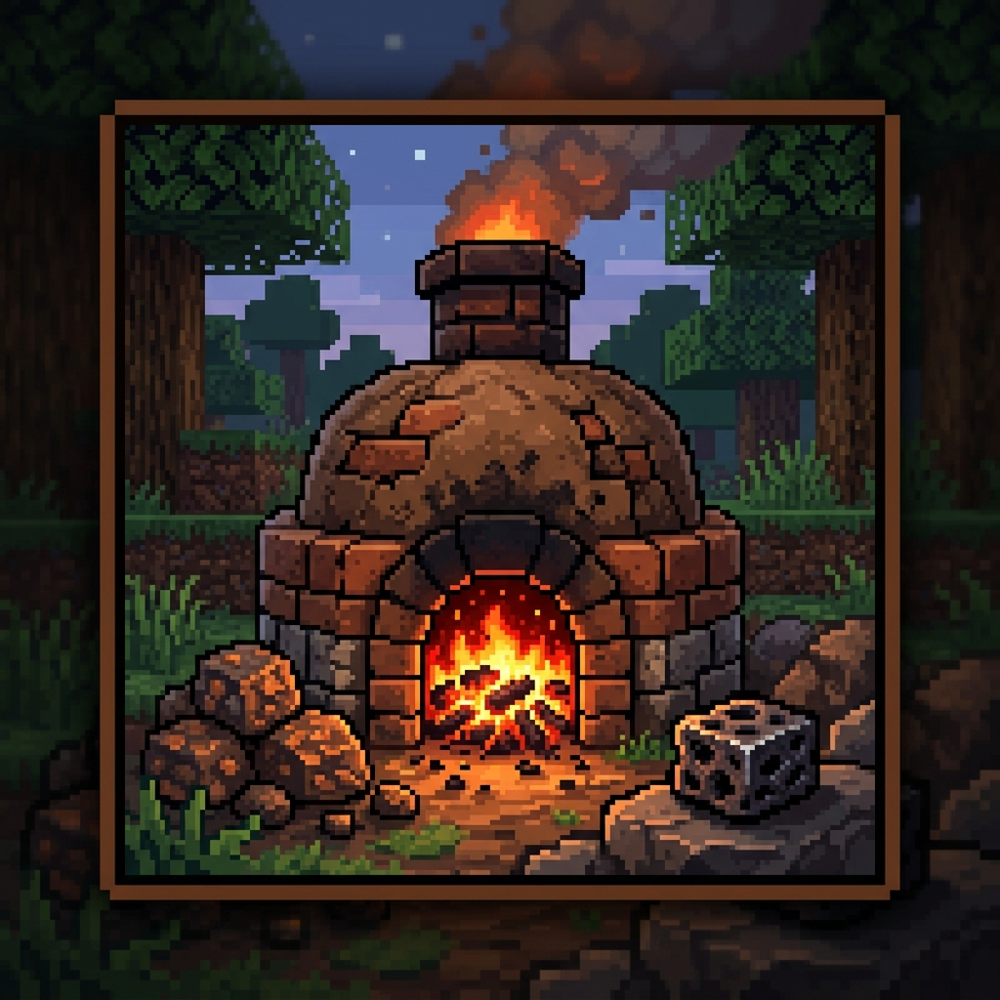

# Bloomery Mod

<p align="center">
  
</p>

A Minecraft 1.21.1 NeoForge mod designed to slow down early-game progression by disabling raw ore smelting in standard furnaces and introducing an authentic **Bloomery Multiblock Smelter**.

---

## 🛠️ Crafting Recipes

Crafting the Bloomery blocks now uses a **diamond shape (4 blocks)** to resemble an opening without requiring expensive extra materials:

### **Packed Mud Bloomery**
```
  M  
 M M 
  M  
```
- **Inputs**: 4 `minecraft:mud` in a diamond shape.
- **Output**: 1 `bloomery:packed_mud_bloomery`.

### **Mud Brick Bloomery**
```
  P  
 P P 
  P  
```
- **Inputs**: 4 `minecraft:packed_mud` in a diamond shape.
- **Output**: 1 `bloomery:mud_brick_bloomery`.

---

## 🧱 Multiblock Structure (bloomery-v2)

The Bloomery uses the streamlined **`bloomery_v2` (3x2x3)** configuration (9 blocks total):

### **Layer 0 (Ground Level)**
```
. B .
M C M
. M .
```
- **`B` (Front Center)**: The **Bloomery Block** (`bloomery:packed_mud_bloomery` or `bloomery:mud_brick_bloomery`) facing outward toward you.
- **`C` (Center)**: `minecraft:campfire` (or soul campfire) placed directly behind the Bloomery block — must be **LIT** (`lit=true`).
- **`M` (3 Wall Blocks)**: Left, Right, and Back enclosing the campfire:
  - For **Packed Mud Bloomery**: Must strictly be `minecraft:packed_mud`.
  - For **Mud Brick Bloomery**: Must strictly be `minecraft:mud_bricks`.
- Corners (`.`) are open/optional.

### **Layer 1 (Chimney Collar)**
```
. M .
M . M
. M .
```
- **Center**: **Open Air** (chimney vent opening directly above the campfire).
- **`M` (4 Chimney Blocks)**: Matching wall blocks:
  - 1 directly above the Bloomery block
  - 3 directly above the left, right, and back walls
  - Material: `minecraft:packed_mud` (or `minecraft:mud_bricks`).
- Corners (`.`) are open.

---

## 🔥 Features & Operation

1. **Smelting & Recipe Matching**:
   - Accepts raw iron, iron ore, deepslate iron ore, raw copper, copper ore, deepslate copper ore, gold, and modded ores (supporting `#c:raw_materials/*` and `#c:ores/*` tags).
   - Robust fallback: Automatically maps any ore disabled from normal furnaces into a valid bloomery recipe.
2. **Visual Campfire Indicator**:
   - The GUI features a distinct **Campfire Icon**:
     - **Bright Fire**: Multiblock is complete and the campfire is lit and actively heating.
     - **Dark / Black**: Campfire is unlit or multiblock is missing.
   - Text popups/tooltips have been removed as requested.
3. **Speeds**:
   - **Packed Mud Bloomery**: Base cooking time (**1200 ticks = 1 minute**).
   - **Mud Brick Bloomery**: **2x as fast** (**600 ticks = 30 seconds**).
4. **Batch Capacity (16 Items)**:
   - Both input and output slots are strictly capped at **16 items** at once (configurable via `maxStackSize` in `bloomery-common.toml`).
   - Shift-clicking will cleanly insert up to 16 items and leave the rest in inventory.
   - Hoppers and automation also respect the 16-item threshold.

---

## ⚙️ Mod Compatibility

### **Primity**
The Bloomery includes **seamless, out-of-the-box compatibility with Primity**:
- **Raw Iron & Iron Ores**: Bloom directly into `primity:cast_iron_ingot` instead of vanilla iron ingots.
- **Cast Iron Blocks**: Bloom into `minecraft:iron_ingot` (allowing full conversion to pure iron through the bloomery multiblock).
- **Cast Iron Ingots**: Bloom into `minecraft:iron_nugget`.
- **Raw Gold & Gold Ores**: Bloom into `minecraft:gold_nugget` in line with Primity's metallurgy balance.
- **Dynamic & Safe**: If Primity is not present or removed, the Bloomery automatically falls back to vanilla iron and gold ingots with zero crashes or missing recipe issues.


